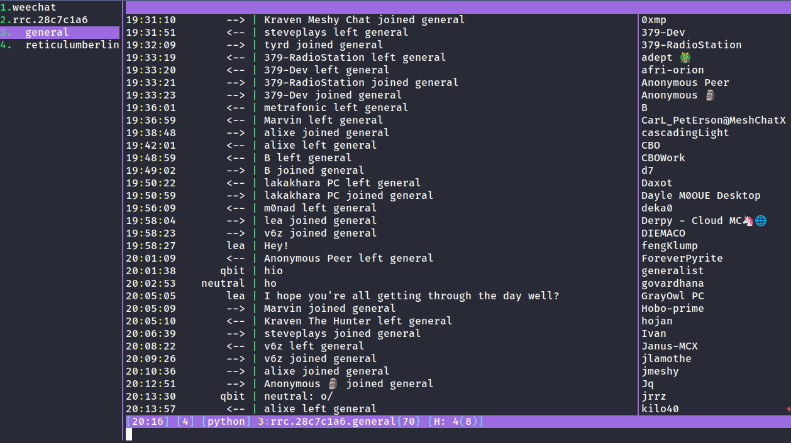

<!--
SPDX-FileCopyrightText: 2026 Afri Blank (@l5yth)
SPDX-License-Identifier: Apache-2.0
-->

# weechat-rrc

[](https://github.com/l5yth/weechat-rrc/actions)
[](LICENSE)

[](https://reticulum.network)

A WeeChat plugin for Reticulum Relay Chat (RRC).



## Requirements

| | |
| --- | --- |
| WeeChat | 4.x with the `python` plugin |
| Python | 3.11+ with `rns` and `cbor2` (see Dependencies) |
| Reticulum | a running shared instance (`rnsd`) |

## Dependencies

`rns` and `cbor2` must be importable Python. Install
them for the system Python and nothing further is needed:

| | |
| --- | --- |
| Arch | `pikaur -S python-rns python-cbor2` |
| Debian | `apt install python3-rns python3-cbor2` |
| other | `pip install --user rns cbor2` |

The `rrc` plugin is looking in the `rrc-venv` if it does not find
any system packages, so the following provides it for weechat-rrc
only (no `/set` required):

```sh
python -m venv ~/.local/share/weechat/rrc-venv
~/.local/share/weechat/rrc-venv/bin/pip install rns cbor2
```

But any other Python works too: 

```sh
/set plugins.var.python.rrc.helper.python <path>
```

## Install

```sh
cp -r rrc.py rrc_helper ~/.local/share/weechat/python/

# optional: load at every WeeChat start
mkdir -p ~/.local/share/weechat/python/autoload
ln -sf ../rrc.py ~/.local/share/weechat/python/autoload/rrc.py
```

`rrc_helper` must stay beside `rrc.py` in `python/`, not in `autoload/`.

```
/script load ~/.local/share/weechat/python/rrc.py
/rrc connect <hub-hash>
```

## Example

Join the general channel of the RNS Community hub:

```
/rrc connect 28c7c1a68c735693aa8e6b8193ed44b2 -nick weechatter
/join general
//who
```

## Commands

| Command | Effect |
| --- | --- |
| `/rrc connect <hub-hash> [-nick <nick>]` | Open a session |
| `/rrc disconnect [<name>]` | Close a session, stop reconnecting |
| `/rrc list` | List connections |
| `/rrc status [<name>]` | Hub, address, identity, state, lag, rooms |
| `/rrc join <#room>` | Enter a room |
| `/rrc part [<#room>]` | Leave a room |
| `/rrc nick <nickname>` | Change advisory nickname |
| `/rrc ping [<name>]` | Measure round-trip time |

With one connection open, `/rrc` commands work from any buffer. With several, name one.

## In RRC buffers

| Typed | Effect |
| --- | --- |
| `<text>` | Message to the room |
| `/join #room` | Enter a room |
| `/part [#room]` | Leave a room |
| `/me <text>` | ACTION |
| `/msg <nick\|hash> <text>` | Direct message |
| `/query <nick\|hash> [text]` | Open a private buffer |
| `/nick <nickname>` | Change advisory nickname |
| `//<hubcommand>` | Send a literal `/command` to the hub |

Intercepted only in RRC buffers. Elsewhere they behave normally.

Hub commands vary per hub. `rrcd` accepts `//who`, `//names`, `//list`, `//topic`,
`//mode`, `//kick`, `//ban`, `//op`, `//deop`, `//voice`, `//devoice`, `//invite`,
`//register`, `//unregister`.

## Settings

`/set plugins.var.python.rrc.<option>`

| Option | Default | Effect |
| --- | --- | --- |
| `helper.python` | *(auto)* | Interpreter running the helper |
| `identity.path` | *(auto)* | Identity file to use |
| `autojoin` | *(empty)* | Comma-separated rooms to rejoin |
| `reconnect` | `on` | Reconnect with backoff on link loss |

Interpreter resolution: `helper.python` → `$RRC_PYTHON` → `python3` →
`~/.local/share/weechat/rrc-venv/bin/python` → `~/.venv/bin/python`.

## Buffers

| Buffer | Contents |
| --- | --- |
| `rrc.<hub>` | Hub state, errors, hub-wide notices |
| `rrc.<hub>.<#room>` | Room messages, nicklist |
| `rrc.<hub>.<hash>` | Direct messages |

Closing a room buffer parts the room. Closing the hub buffer disconnects.

## Identity

Default: `~/.config/weechat/rrc/identity`, mode `0600`, created on first connect.

- The identity hash is your only identifier. Nicknames are advisory.
- No account recovery. Losing the key file loses the identity permanently.
- Back it up.

## Scope

- Reticulum configuration needs to be done for the system. A running shared instance is
  assumed; this client never reads or writes `~/.reticulum/config`.
- No message history. Messages sent while disconnected are lost.
- Resource transfer (RRC type 50) is not implemented. Long hub MOTDs may arrive
  truncated.

## Development

```sh
make test        # unit suite
make coverage    # 100% line + branch floor
make fmt-check   # black
make docs        # API-doc coverage
make e2e         # against a local rrcd hub
```

`make e2e` needs `rrcd` (`pip install rrcd`, or `RRCD_PATH=<checkout>`).
Skips with a reason when unavailable.

## License

Apache v2.0

